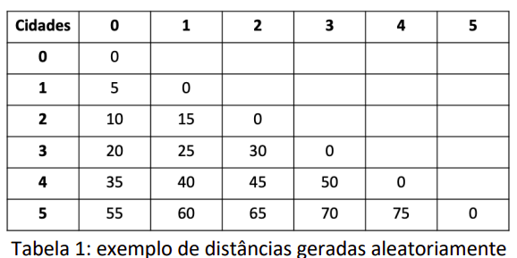

# Caixeiro Genético

## Introdução ao Problema:

Suponha que um caixeiro viajante tenha que visitar n cidades diferentes, iniciando e
encerrando sua viagem na primeira cidade. Suponha, também, que não importa a
ordem com que as cidades são visitadas e que de cada uma delas o caixeiro pode ir
diretamente para qualquer outra. O problema do caixeiro viajante consiste em descobrir
a rota que torna mínima a viagem total.

Exemplificando o caso n = 4:  
Se tivermos quatro cidades 0, 1, 2 e 3. Uma rota que o caixeiro viajante deve considerar poderia ser: Saia de 0 e vá para 1, de 1 vá para 2, e depois vá para 3 e então volte para 0.

Quais são as outras possibilidades? É fácil ver que existem seis rotas possíveis:
- 01230
- 01320
- 02130
- 02310
- 03120
- 03210 

 

## Exercício Proposto:

    Implemente em Python um Algoritmo Evolutivo para a resolução do problema do
    Caixeiro viajante considerando 6 (seis) cidades. Em seu código, gere as distâncias entre
    as cidades de maneira aleatória. Seu programa deve encontrar a melhor rota partindo
    da cidade 0, passando por todas as cidades e retornando à cidade 0. A Tabela 1
    apresenta um exemplo de distâncias geradas aleatoriamente. Defina a melhor maneira
    de modelar seus indivíduos que representam as soluções do problema, e também a
    função de fitness. Faça suas próprias escolhas sobre os operadores de seleção,
    cruzamento, mutação e elitismo. Não é permitido utilizar bibliotecas prontas.

  

## Licença
[MIT](https://choosealicense.com/licenses/mit/)

Código desenvolvido para atividade da disciplina de  Inteligência Artificial da Universidade Federal de São Carlos (UFSCar).